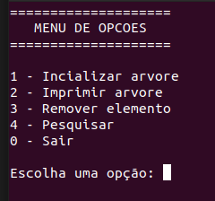

# Exercicio AVL

Daniel Alves Sanches - 4º Periodo - AEDS II

## Execução

- A programação foi realizada no ubunto

- Para compilar o código execute os seguintes comandos:

> make clean

> make

> make run

## Menu principal

- O menu é composto de 5 opçoes

    - A opção 1 irá inicializar a arvore com elementos predefinido

    - A opção 2 irá imprir os elementos da árvore no formato pre ordem, central e pos ordem

    - A opção 3 irá remover um elemento informado pelo usuário caso exista

    - A opção 4 irá pesquisar um elemento informado pelo usuario e será impresso os elementos filhos no formato pre ordem